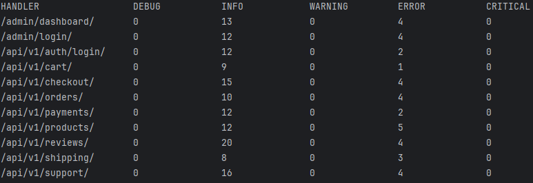

# Django Log Analyzer CLI

## 🚀 Установка

```bash
git clone https://github.com/d0kuzu/log_analyzer.git
cd django-log-analyzer
pip install -r requirements.txt
```

## 🛠 Использование

```bash
python main.py files/app1.log files/app2.log files/app3.log --report handlers
```
(или используйте свой вариант логов)

### Аргументы

| Аргумент     | Описание                                   |
|--------------|---------------------------------------------|
| `--logs`     | Один или несколько путей к лог-файлам       |

### Пример вывода



## ⚙️ Пример архитектуры

- `analyze.py` — CLI-входная точка
- `parser.py` — логика разбора лог-файлов
- `reporting/` — директория с модулями генерации отчётов
- `tests/` — юнит-тесты

## 📦 Масштабируемость

Каждый лог-файл обрабатывается отдельно в отдельном процессе. Приложение масштабируется автоматически в зависимости от количества лог-файлов и доступных CPU.

## 🧪 Тестирование

```bash
pytest tests/
```
